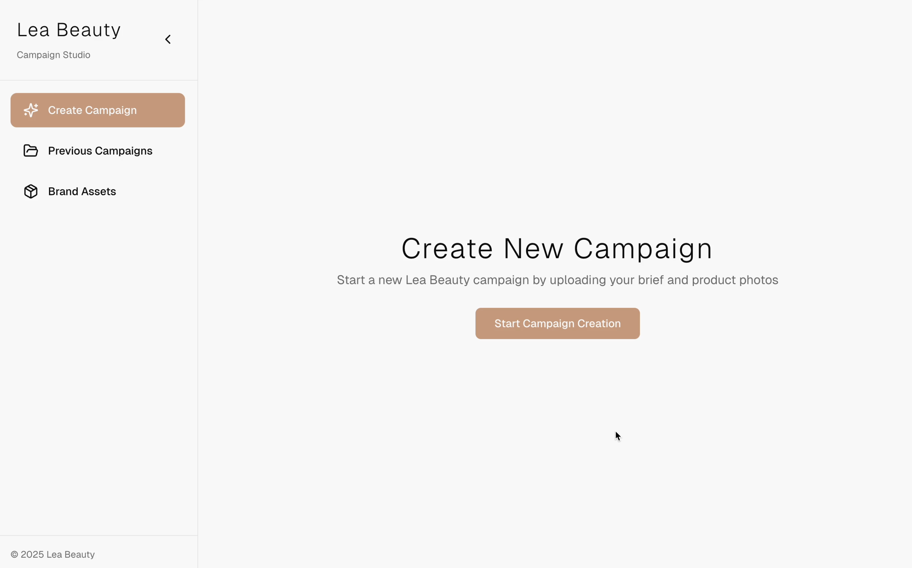

# Lea Beauty Campaign Generator



Lea Beauty Campaign Generator is the ultimate solution for transforming unstructured, uniquely formatted briefs into actionable, high-impact campaign strategies. It empowers marketing teams to generate AI-powered campaigns from start to finish, with full control over target audience segments and platform- or persona-specific social media content. Seamlessly bridge the gap between campaign strategy and creative execution, all in one intuitive workflow. ✨
---

## 🚀 Features

**Implemented features:**
- Generate structured campaign briefs from unstructured pdf emails including:
  - Campaign overview
  - Product description
  - Main goals
  - Multiple target audience segments
- Generate audience-specific captions for Instagram, TikTok, and website
  - Confidence scoring for each caption
  - Warnings for potentially exclusionary, offensive, or inappropriate content
- Generate audience specific product images in 3 aspect ratios
- Store campaigns, audiences, and generated content in MongoDB, and assets in shared volume (can be replaced with S3 or other cloud storage)
- File uploads and media management for campaign assets

**Roadmap / Upcoming features:**
- Modifying images while keeping consistent background/composition
- Adding analytics and campaign results to campaign content management
- Taking into account of historical data, brand guidelines, and assets (with multi-shot RAG pipeline and/or Google Filesearch)
- Template library for recurring campaign types

---

## ⚡ Getting Started

1. **Clone the repository**
```bash
git clone https://github.com/leabuende/campaign-manager.git
cd campaign-manager
````

2. **Configure the Gemini API key in Docker Compose**
* Obtain your Gemini API key [here](https://aistudio.google.com/app/apikey?hl=fr&_gl=1*54tehj*_ga*MjA2MjcwMTk1OC4xNzYyOTU2MjYy*_ga_P1DBVKWT6V*czE3NjI5NTYyNjIkbzEkZzAkdDE3NjI5NTYyNjckajU1JGwwJGgxOTc1NzU0ODM1)
* Open `shared/docker-compose.yml`
* Add your Gemini API key to the `backend` service environment:

```yaml
environment:
  - GEMINI_API_KEY=your_api_key_here
```

3. **Start the application using Docker Compose**

* Navigate to the `shared` folder:

```bash
cd shared
docker-compose up --build
```

* This will start all services: MongoDB, backend, and frontend.

4. **Access the application**

* Frontend: [http://localhost:3000](http://localhost:3000)
* Backend API: [http://localhost:8001](http://localhost:8001)

---

## 📦 Directory Structure

* `backend/` — FastAPI service with API routes and MongoDB integration
* `frontend/` — Next.js frontend with campaign generator UI
* `uploads/` — Folder to store uploaded campaign assets
* `shared/` — Contains Docker Compose configuration
